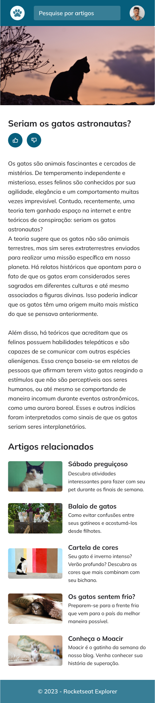

<h1 align="center"> Blog de Gatos </h1>

  <a href="#-tecnologias">Tecnologias</a>&nbsp;&nbsp;&nbsp;|&nbsp;&nbsp;&nbsp;
  <a href="#-projeto">Projeto</a>&nbsp;&nbsp;&nbsp;|&nbsp;&nbsp;&nbsp;
  <a href="#memo-licença">Licença</a>

  

 

  <h2 align="center">Desktop:</h2>
  

  <h2 align="center">Mobile:</h2>
  

    
  

## 🚀 Tecnologias

Esse projeto foi desenvolvido com as seguintes tecnologias:

- HTML e CSS (clamp)
- Git e Github
- Figma

## 💻 Projeto

Essa landing page foi feita para estudar um pouco mais sobre resposividade, usando media queries

## :memo: Licença

Esse projeto está sob a licença MIT.

---

